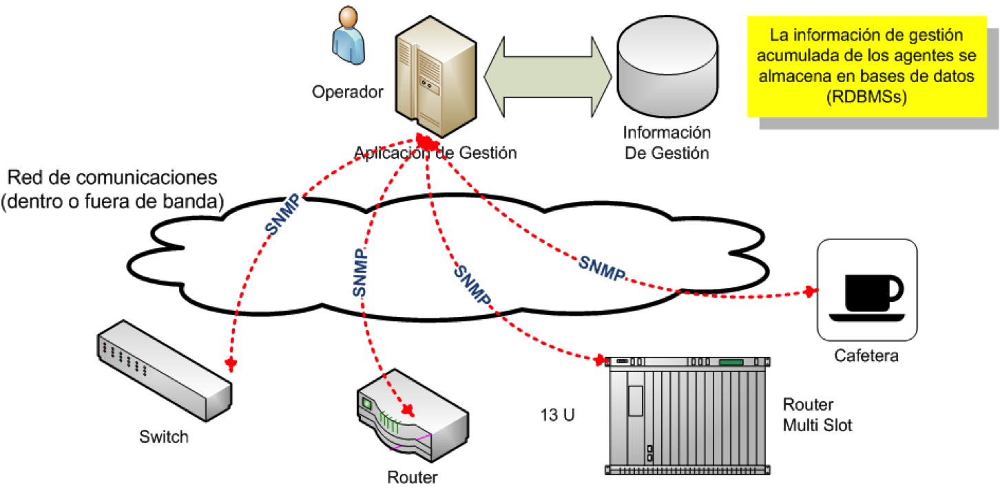
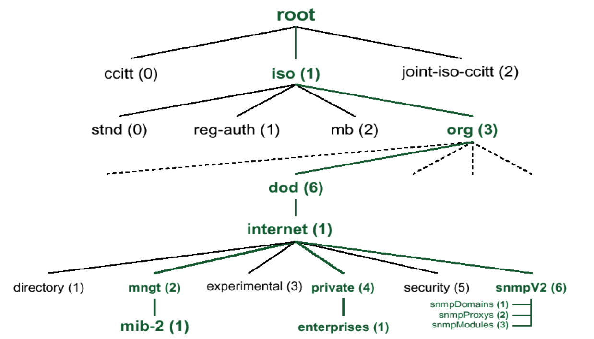
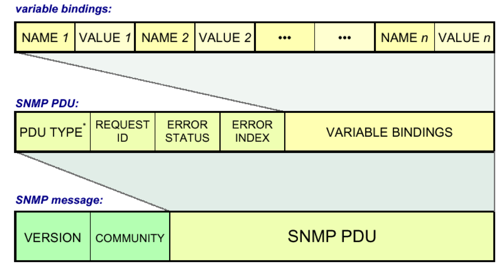
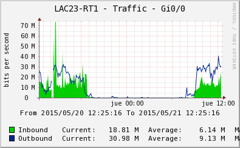

<!-- background: #fff -->
<!-- color: #000 -->
<!-- font: frutiger -->

# **Monitoreo con SNMP**


***

# Monitoreo con SNMP

Todo el material que utilizo en esta presentacion esta en [GitHub](https://github.com/LACNIC/tutorial-netmon/docs/netmon-bogota-2015/tutorial-network-monitoring.git)

https://github.com/LACNIC/tutorial-netmon/docs/netmon-bogota-2015/tutorial-network-monitoring.git

***

# Network Management

NM es el conjunto de tecnicas que empleamos para la configuracion, la administracion el monitoreo y el aprovisionamiento de dispositivos y servicios de red.

[FCAPS](http://en.wikipedia.org/wiki/FCAPS) http://en.wikipedia.org/wiki/FCAPS

Fault, Configuration, Accounting, Performance y Security.

***

# Gestion de fallas

Una falla (o falta) es un evento adverso en la red. La caida de un enlace, un reboot de un router o un error en una publicación BGP pueden ser todos ejemplos de fallas.

***

# Gestion de configuracion


Copiar, almacenar y versionar configuracion de dispositivos.

Incluye tanto la generación de archivos de configuración como el respaldo, versionado y control de cambios de estos archivos de configuración.

***

# Gestion de 'accounting'

Obtener estadisticas de uso de los usuarios y dispositivos de la red. Valores como trafico por interfaz, uso de CPU, cantidad de rutas, etc, son todos ejemplos de estadisticas de uso.

***

# Gestion de performance

Asegurar que el desempeño de la red se mantiene a niveles aceptables en todo momento, para que quienes planifican la red puedan contar con informacion que les permita dimensionar los anchos de banda de los enlaces, contar con los dispositivos de red adecuados y entre otras cosas, puedan **gestionar sus acuerdos de peering**

***

# Gestion de seguridad

Controlar los accesos a los dispositivos de red así como la confidencialidad e integridad de la información acumulada durante el proceso de gestión de red.

***

# SNMP

SNMP: Simple Network Management Protocol

Protocolo para gestion de redes basado en un modelo de agente y gestor, donde una estacion de gestion periódicamente consulta a los dispositivos de red y realiza consultas por diferentes **variables** 



***

# SNMP: Protocol

**SNMP (v1, v2c, v3)**: diferentes versiones del protocolo de _transporte_ de la informacion de gestión.

Basado en UDP, puertos 161 y 162.

Funciones:

* GET: operacion de lectura (G -> A)
* SET: operacion de escritura (G -> A)
* TRAP: información de evento especial (A -> G)

***

# SNMP: Management Information Base

**MIB (v1, v2)** Esquema de datos implementado por los dispositivos de red que colectan información de gestión.

La MIB es un conjunto de variables o parametros que son medidos por los dispositivos y que pueden ser leidos por el gestor utilizando operaciones **GET**

Los objetos de la MIB están estructurados en forma de un arbol.

***

# SNMP: Management Information Base



***

# SNMP: Management Information Base

Toda variable esta identificada por:
* Una denominación numérica:
	```
	1.3.6.1....
	```
	* Refleja el “camino en el arbol” para llegar a ella 
	
***

# SNMP: Management Information Base

Toda variable esta identificada por:
* Una denominación textual
	```
   iso.org.dod.internet....
   ```
   Tambien refleja el camino en el arbol, pero de una manera mas humanamente comprensible.
   
Cada variable o parametro tiene un tipo de datos:
* Entero/string 
* Escalar/tabla

***

# SNMP: MIB, tipos de datos

Básicos (Universales de ASN.1)
```
Integer
Octectstring
Null
Object identifier
Sequence
```

***

# SNMP: MIB, tipos de datos

Tipos definidos por IETF para la aplicación SNMP
```
ipaddress: 32b, direccion IP
counter: 32b, int, puede ser incrementado pero NO decrementado
gauge: 32b, int, puede ser tanto incrementado como decrementado
timeticks: centésimas de segundo
opaque: tipo reservado para el pasaje de datos arbitrarios.
```

***

# SNMP: Operaciones y PDUs

**getRequest**: Obtener el valor de una variable
**getNextRequest**: Obtener el valor de la “siguiente” (de acuerdo al árbol) variable
**getResponse**: Paquete de respuesta a un get/getNext
**setRequest**: Cambiar el valor de una variable
**Trap**: Envío de información no solicitada por el gestor por parte del agente.

***

# SNMP: Operaciones y PDUs



***

# SNMP: ¿Que cosas se pueden hacer con SNMP?

* Chequear el estado de las interfaces
* Medir trafico
* Medir utilizacion de CPU
* Obtener la tabla de enrutamiento

***

# SNMP: Medicion de trafico

## ifDescr y ifIndex

```
root@vy-64:~# snmpwalk -v1 -c public 10.0.1.254 ifDescr
IF-MIB::ifDescr.1 = STRING: FastEthernet0/0
IF-MIB::ifDescr.2 = STRING: FastEthernet1/0
IF-MIB::ifDescr.3 = STRING: FastEthernet1/1
IF-MIB::ifDescr.4 = STRING: Serial2/0
```

***

# SNMP: Medicion de trafico

```
root@vy:~# snmpwalk -v1 -c public 10.0.1.254 ifOutOctets
IF-MIB::ifOutOctets.1 = Counter32: 1875400
IF-MIB::ifOutOctets.2 = Counter32: 0
IF-MIB::ifOutOctets.3 = Counter32: 0
```

***

# SNMP: Demo **snmpwalk**

_Wish me luck!_

***

# SNMP: Medicion de trafico



Utilizando herramientas como [Cacti](http://www.cacti.net) podemos graficar diferentes variables, identificando tendencias e incluso programando alarmas de acuerdo a diferentes valores.

***

# SNMP: Demo **[Cacti](http://www.cacti.net)** 

_Oh, Margot!_

***

# SNMP: Estado de las sesiones BGP

```
root@vy-64:~# snmpwalk -v1 -c public 10.0.1.254 bgpPeerState
BGP4-MIB::bgpPeerState.10.0.1.1 = INTEGER: established(6)
BGP4-MIB::bgpPeerState.10.0.1.2 = INTEGER: established(6)
BGP4-MIB::bgpPeerState.10.0.1.3 = INTEGER: established(6)
BGP4-MIB::bgpPeerState.10.0.1.4 = INTEGER: established(6)
```

***

# SNMP: Midiendo tráfico IPv6

IP-MIB definida en RFC 4293, Abril 2006

Define contadores de 32 y 64 bits para IPv4 e IPv6

* Sin embargo no todos los equipos lo soportan
* Generalmente las ultimas versiones lo adoptan
* A veces el tráfico no se cuenta de forma correcta
* En algunos casos solo estan definidos los contadores para IPv6 (IPv4 = total - IPv6)
* Verificar en cada equipo el grado de implementacion de esta MIB


***

# SNMP: OIDs para contadores trafico IPv6

inOctets/outOctects 32 bits; HCinOctets/HCoutOctets 64 bit
En el caso de usar HC (high capacity) se debe usar SNMP v2

**ipIfStatsHCInOctets**
1.3.6.1.2.1.4.31.3.1.6
**ipIfStatsHCOutOctets**
1.3.6.1.2.1.4.31.3.1.33

Version de IP: 0 unknown; 1 IPv4; 2 IPv6

Entonces: 
1.3.6.1.2.1.4.31.3.1.6.2  -> IP-MIB::ipIfStatsHCOutOctets.ipv6
1.3.6.1.2.1.4.31.3.1.33.2 -> IP-MIB::ipIfStatsHCOutOctets.ipv6

***


# **¡Muchas Gracias!**

