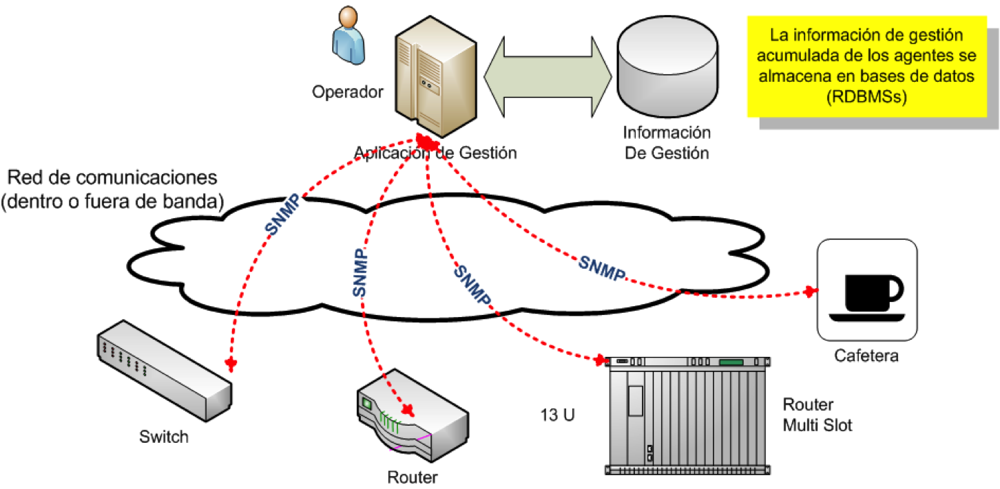
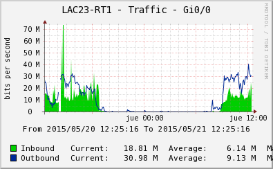
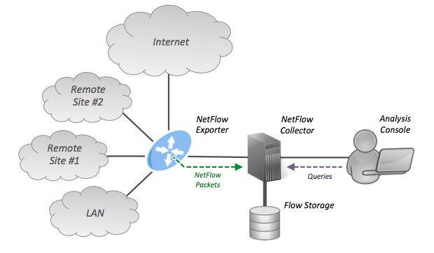

<!-- background: #fff -->
<!-- color: #000 -->
<!-- font: frutiger -->

# **Monitoreo de Sitios de Peering**


***

# Monitoreo de Sitios de Peering

Todo el material que utilizo en esta presentacion esta en [GitHub](https://github.com/carlosm3011/tutorial-network-monitoring.git)

https://github.com/carlosm3011/tutorial-network-monitoring.git

***

# Monitoring peering

Table of contents:
- What is network management ? Areas, protocols and techniques
- Monitoring for network failures
- Monitoring traffic flows
- Tools roundup

***

# Network Management

NM es el conjunto de tecnicas que empleamos para la configuracion, la administracion el monitoreo y el aprovisionamiento de dispositivos y servicios de red.

[FCAPS](http://en.wikipedia.org/wiki/FCAPS)

Fault, Configuration, Accounting, Performance y Security.

***

# Gestion de fallas

Una falla (o falta) es un evento adverso en la red. La caida de un enlace, un reboot de un router o un error en una publicación BGP pueden ser todos ejemplos de fallas.

***

# Gestion de configuracion


Copiar, almacenar y versionar configuracion de dispositivos.

Incluye tanto la generación de archivos de configuración como el respaldo, versionado y control de cambios de estos archivos de configuración.

***

# Gestion de 'accounting'

Obtener estadisticas de uso de los usuarios y dispositivos de la red. Valores como trafico por interfaz, uso de CPU, cantidad de rutas, etc, son todos ejemplos de estadisticas de uso.

***

# Gestion de performance

Asegurar que el desempeño de la red se mantiene a niveles aceptables en todo momento, para que quienes planifican la red puedan contar con informacion que les permita dimensionar los anchos de banda de los enlaces, contar con los dispositivos de red adecuados y entre otras cosas, puedan **gestionar sus acuerdos de peering**

***

# Gestion de seguridad

Controlar los accesos a los dispositivos de red así como la confidencialidad e integridad de la información acumulada durante el proceso de gestión de red.

***

# SNMP

SNMP: Simple Network Management Protocol

Protocolo para gestion de redes basado en un modelo de agente y gestor, donde una estacion de gestion periódicamente consulta a los dispositivos de red y realiza consultas por diferentes **variables** 



***

# SNMP: Protocol

**SNMP (v1, v2c, v3)**: diferentes versiones del protocolo de _transporte_ de la informacion de gestión.

Basado en UDP, puertos 161 y 162.

Funciones:

* GET: operacion de lectura (G -> A)
* SET: operacion de escritura (G -> A)
* TRAP: información de evento especial (A -> G)

***

# SNMP: Management Information Base

**MIB (v1, v2)** Esquema de datos implementado por los dispositivos de red que colectan información de gestión.

La MIB es un conjunto de variables o parametros que son medidos por los dispositivos y que pueden ser leidos por el gestor utilizando operaciones **GET**

Los objetos de la MIB están estructurados en forma de un arbol.

***

# SNMP: Management Information Base


***

# SNMP: Management Information Base

Toda variable esta identificada por:
* Una denominación numérica:
	```
	1.3.6.1....
	```
	* Refleja el “camino en el arbol” para llegar a ella 
	
***

# SNMP: Management Information Base

Toda variable esta identificada por:
* Una denominación textual
	```
   iso.org.dod.internet....
   ```
   Tambien refleja el camino en el arbol, pero de una manera mas humanamente comprensible.
   
Cada variable o parametro tiene un tipo de datos:
* Entero/string 
* Escalar/tabla

***

# SNMP: MIB, tipos de datos

Básicos (Universales de ASN.1)
```
Integer
Octectstring
Null
Object identifier
Sequence
```

***

# SNMP: MIB, tipos de datos

Tipos definidos por IETF para la aplicación SNMP
```
ipaddress: 32b, direccion IP
counter: 32b, int, puede ser incrementado pero NO decrementado
gauge: 32b, int, puede ser tanto incrementado como decrementado
timeticks: centésimas de segundo
opaque: tipo reservado para el pasaje de datos arbitrarios.
```

***

# SNMP: Operaciones y PDUs

**getRequest**: Obtener el valor de una variable
**getNextRequest**: Obtener el valor de la “siguiente” (de acuerdo al árbol) variable
**getResponse**: Paquete de respuesta a un get/getNext
**setRequest**: Cambiar el valor de una variable
**Trap**: Envío de información no solicitada por el gestor por parte del agente.

***

# SNMP: Operaciones y PDUs


***

# SNMP: ¿Que cosas se pueden hacer con SNMP?

* Chequear el estado de las interfaces
* Medir trafico
* Medir utilizacion de CPU
* Obtener la tabla de enrutamiento

***

# SNMP: Medicion de trafico

## ifDescr y ifIndex

```
root@vy-64:~# snmpwalk -v1 -c public 10.0.1.254 ifDescr
IF-MIB::ifDescr.1 = STRING: FastEthernet0/0
IF-MIB::ifDescr.2 = STRING: FastEthernet1/0
IF-MIB::ifDescr.3 = STRING: FastEthernet1/1
IF-MIB::ifDescr.4 = STRING: Serial2/0
```

***

# SNMP: Medicion de trafico

```
root@vy:~# snmpwalk -v1 -c public 10.0.1.254 ifOutOctets
IF-MIB::ifOutOctets.1 = Counter32: 1875400
IF-MIB::ifOutOctets.2 = Counter32: 0
IF-MIB::ifOutOctets.3 = Counter32: 0
```

***

# SNMP: Demo **snmpwalk**

_Wish me luck!_

***

# SNMP: Medicion de trafico



Utilizando herramientas como [Cacti](http://www.cacti.net) podemos graficar diferentes variables, identificando tendencias e incluso programando alarmas de acuerdo a diferentes valores.

***

# SNMP: Demo **[Cacti](http://www.cacti.net)** 

_Oh, Margot!_

***

# SNMP: Estado de las sesiones BGP

```
root@vy-64:~# snmpwalk -v1 -c public 10.0.1.254 bgpPeerState
BGP4-MIB::bgpPeerState.10.0.1.1 = INTEGER: established(6)
BGP4-MIB::bgpPeerState.10.0.1.2 = INTEGER: established(6)
BGP4-MIB::bgpPeerState.10.0.1.3 = INTEGER: established(6)
BGP4-MIB::bgpPeerState.10.0.1.4 = INTEGER: established(6)
```

***

# **NetFlow**


*** 

# **NetFlow** Medicion de flujos de trafico

**Netflow** es un mecanismo de monitoreo de flujos de trafico, originalmente creado por Cisco pero luego estandarizado por el [IETF](http://www.ietf.org).

Permite determinar con precisión los intercambios de trafico entre los diferentes puntos de la red (_matriz de tráfico_).

¿Que es un flujo de trafico?

***

# Netflow

Cisco, para NetFlow v5 define un flujo como una secuencia unidireccional de paquetes que comparten los mismos:

* Interfaz de entrada (SNMP ifIndex)
* Direccion IP de origen
* Direccion IP de destino
* Protocolo IP (tcp, udp, icmp, etc.)
* Puerto (udp,tcp) de origen
* Puerto (udp,tcp) de destino o tipo para icmp
* IP ToS

***

# Netflow



***

# NetFlow: Herramientas

* Pagas
	* Muchas, para elegir
* Open Source
	* flow-tools
	* nfdump

***

# NetFlow: Configuracion base de un colector

Utilizando Vagrant se puede construir un colector muy básico per funcional de NetFlow.

***

# NetFlow: Instalacion de un colector NF

(Utilizando [Vagrant](http://vagrantup.com))

```
  # Ejecutar el shell
  config.vm.provision "shell", inline: <<-SHELL
  	 sudo sed -i "/^# deb .* multiverse$/ s/^# //" /etc/apt/sources.list 
     sudo apt-get update
     sudo apt-get install -y apache2
     sudo apt-get install -y flow-tools
     sudo apt-get install -y snmp snmpd
     sudo apt-get install -y bridge-utils
     sudo apt-get install -y openvpn
     sudo apt-get install -y snmp-mibs-downloader
     sudo download-mibs
     #
     sudo mkdir -p /var/flow/routeserver
     sudo mkdir -p /var/flow/R1
     sudo mkdir -p /var/flow/R4
	 #
	 sudo /etc/init.d/flow-capture restart
     #
     sudo ping -f -c10 10.0.1.254
  SHELL

```

***

# NetFlow: Captura de flujos

```
# Configuration for flow-capture
# Capture flows from router at 10.0.1.*, listening at port 999x.
# Store flows in /var/flow/myrouter.
-w /var/flow/routeserver 0/10.0.1.254/9996
-w /var/flow/R1 0/10.0.1.1/9997
-w /var/flow/R4 0/10.0.1.4/9998
```

***

# NetFlow: flow-print

```
root@vy-64:~# flow-cat /var/flow/R1 | flow-print | head -20
srcIP            dstIP            prot  srcPort  dstPort  octets      packets
10.0.1.253       10.0.1.1         1     0        771      128         1         
10.0.1.254       10.0.1.1         6     179      31510    99          2         
10.0.1.254       10.0.1.1         6     179      31510    99          2         
192.168.30.1     10.0.1.1         1     0        0        500         5         
10.0.1.254       10.0.1.1         6     179      31510    139         3         
10.0.1.254       10.0.1.1         6     179      31510    99          2         
10.0.1.254       10.0.1.1         6     179      31510    99          2         
10.0.1.254       10.0.1.1         6     179      31510    99          2         
10.0.1.254       10.0.1.1         6     179      31510    40          1     
```

***

# NetFlow: Demo

_Watch out for the demo effect!_

***

# **¡Muchas Gracias!**

