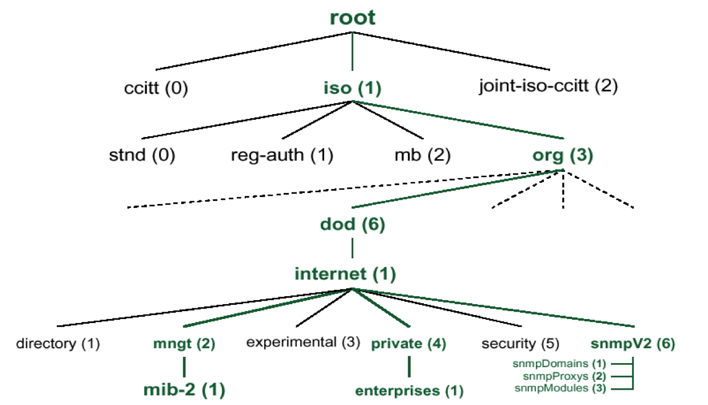
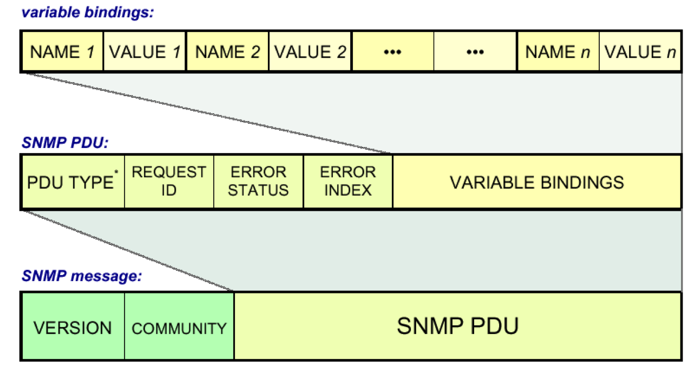

<!-- background: #fff -->
<!-- color: #000 -->
<!-- font: frutiger -->

# Monitoring Peering Setups

***

# Monitoring peering

Table of contents:
- What is network management ? Areas, protocols and techniques
- Monitoring for network failures
- Monitoring traffic flows
- Tools roundup

***

# Network Management

NM es el conjunto de tecnicas que empleamos para la configuracion, la administracion el monitoreo y el aprovisionamiento de dispositivos y servicios de red.

[FCAPS](http://en.wikipedia.org/wiki/FCAPS)

Fault, Configuration, Accounting, Performance y Security.

***

# Gestion de fallas

Una falla (o falta) es un evento adverso en la red. La caida de un enlace, un reboot de un router o un error en una publicación BGP pueden ser todos ejemplos de fallas.

***

# Gestion de configuracion

Copiar, almacenar y versionar configuracion de dispositivos.

Incluye tanto la generación de archivos de configuración como el respaldo, versionado y control de cambios de estos archivos de configuración.

***

# Gestion de 'accounting'

Obtener estadisticas de uso de los usuarios y dispositivos de la red. Valores como trafico por interfaz, uso de CPU, cantidad de rutas, etc, son todos ejemplos de estadisticas de uso.

***

# Gestion de performance

Asegurar que el desempeño de la red se mantiene a niveles aceptables en todo momento, para que quienes planifican la red puedan contar con informacion que les permita dimensionar los anchos de banda de los enlaces, contar con los dispositivos de red adecuados y entre otras cosas, puedan **gestionar sus acuerdos de peering**

***

# Gestion de seguridad

Controlar los accesos a los dispositivos de red así como la confidencialidad e integridad de la información acumulada durante el proceso de gestión de red.

***

# SNMP

SNMP: Simple Network Management Protocol

Protocolo para gestion de redes basado en un modelo de agente y gestor, donde una estacion de gestion periódicamente consulta a los dispositivos de red y realiza consultas por diferentes **variables** 


***

# SNMP: Protocol

**SNMP (v1, v2c, v3)**: diferentes versiones del protocolo de _transporte_ de la informacion de gestión.

Basado en UDP, puertos 161 y 162.

Funciones:

* GET: operacion de lectura (G -> A)
* SET: operacion de escritura (G -> A)
* TRAP: información de evento especial (A -> G)

***

# SNMP: Management Information Base

**MIB (v1, v2)** Esquema de datos implementado por los dispositivos de red que colectan información de gestión.

La MIB es un conjunto de variables o parametros que son medidos por los dispositivos y que pueden ser leidos por el gestor utilizando operaciones **GET**

Los objetos de la MIB están estructurados en forma de un arbol.

***

# SNMP: Management Information Base



***

# SNMP: Management Information Base

Toda variable esta identificada por:
* Una denominación numérica:
	```
	1.3.6.1....
	```
	* Refleja el “camino en el arbol” para llegar a ella 
	
***

# SNMP: Management Information Base

Toda variable esta identificada por:
* Una denominación textual
	```
   iso.org.dod.internet....
   ```
   Tambien refleja el camino en el arbol, pero de una manera mas humanamente comprensible.
   
Cada variable o parametro tiene un tipo de datos:
* Entero/string 
* Escalar/tabla

***

# SNMP: MIB, tipos de datos

Básicos (Universales de ASN.1)
```
Integer
Octectstring
Null
Object identifier
Sequence
```

***

# SNMP: MIB, tipos de datos

Tipos definidos por IETF para la aplicación SNMP
```
ipaddress: 32b, direccion IP
counter: 32b, int, puede ser incrementado pero NO decrementado
gauge: 32b, int, puede ser tanto incrementado como decrementado
timeticks: centésimas de segundo
opaque: tipo reservado para el pasaje de datos arbitrarios.
```

***

# SNMP: Operaciones y PDUs

**getRequest**: Obtener el valor de una variable
**getNextRequest**: Obtener el valor de la “siguiente” (de acuerdo al árbol) variable
**getResponse**: Paquete de respuesta a un get/getNext
**setRequest**: Cambiar el valor de una variable
**Trap**: Envío de información no solicitada por el gestor por parte del agente.

***

# SNMP: Operaciones y PDUs



***

